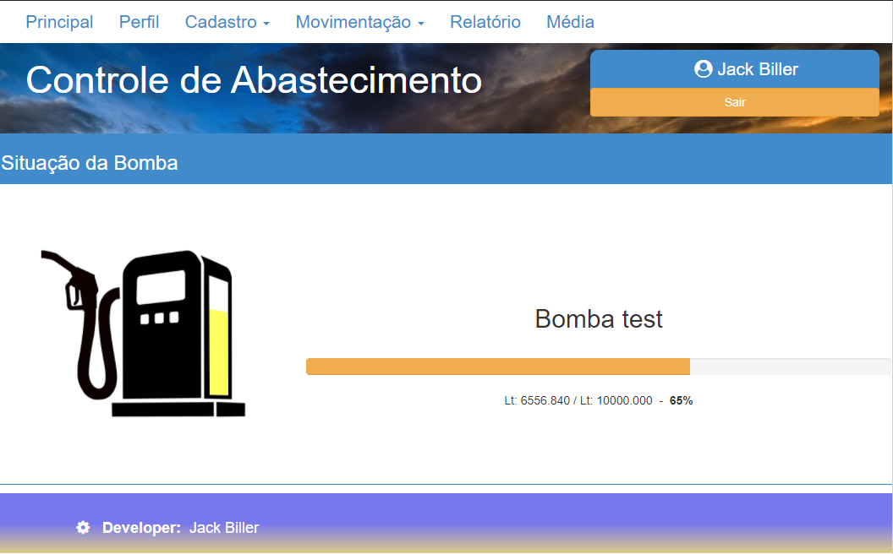
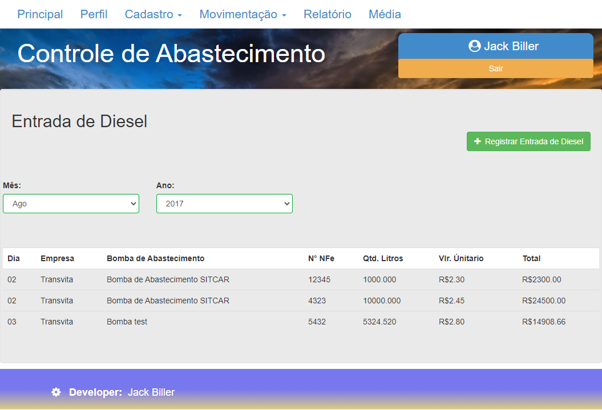
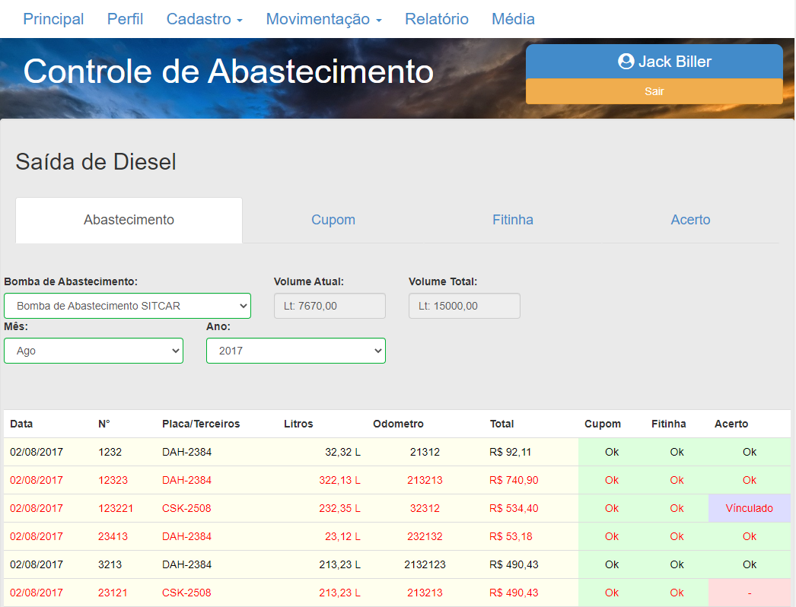
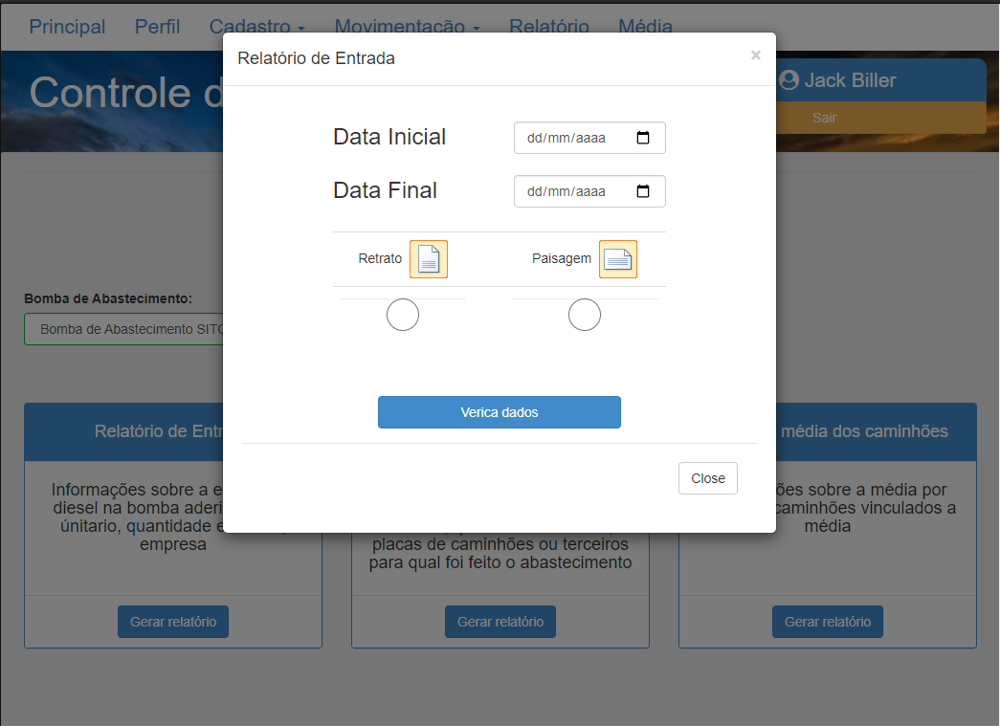
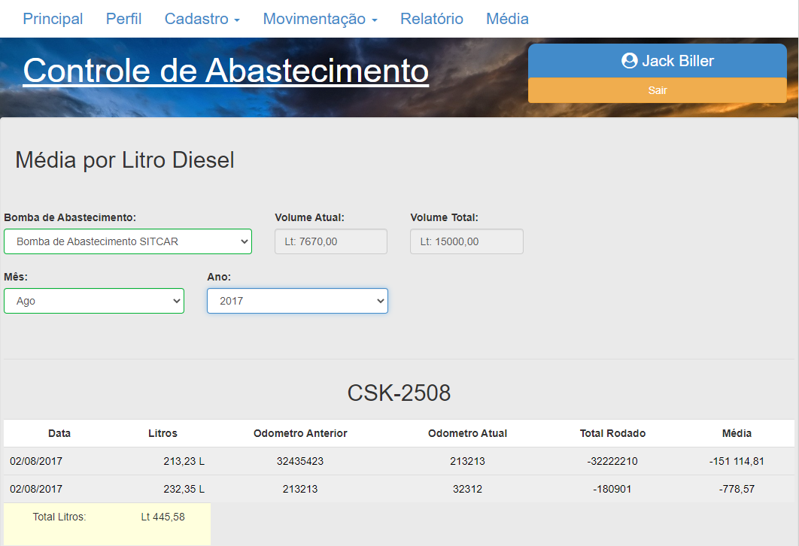

## Controle de Abastecimento

Gerir as movimentações de entrada e saida de diesel de uma bomba de abastecimento

O sistema tem como objetivo facilitar o controle de movimentações de diesel de uma bomba de abastecimento que antes era feito em uma planilha do excel, com o sistema fica mais facil tirar relatorios, gerenciar lançamentos entre os meses e ter o controle da origem do lançamento, podendo vir do lançamento da ficha de viajem do motorista, do comprovante emitido pela bomba e do bloco de notas que o funcionário que abastecia os caminhões anotava.

### Tecnologias Utilizadas
- Angular 1
- PHP
- HTML, CSS e JavaScript
- jQuery
- Bootstrap 3
- MySQL

### Fotos

